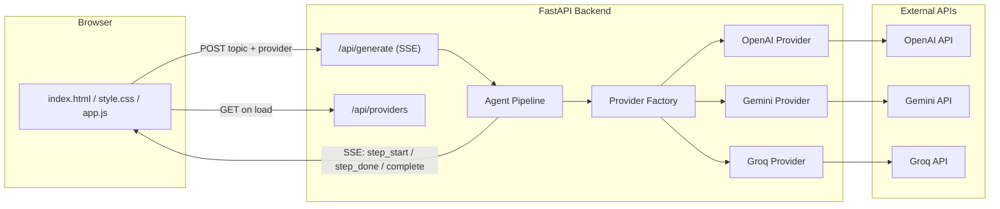
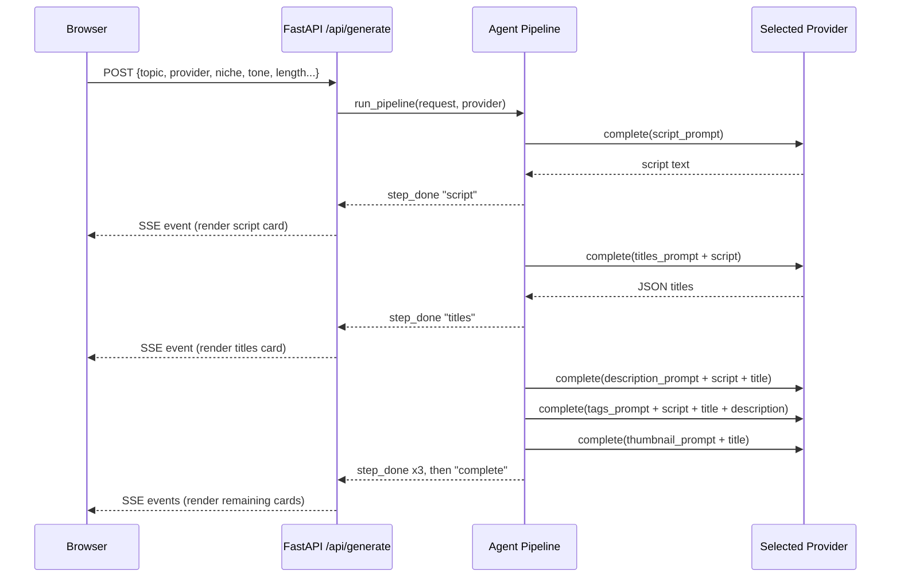

# Content Agent — AI YouTube Content Pipeline

A small, self-hosted AI agent that turns **one video topic** into a **complete, internally-consistent content package**: script → titles → SEO description → tags → thumbnail concept — built with FastAPI, a vanilla HTML/CSS/JS frontend, and your choice of OpenAI, Google Gemini, or Groq as the LLM backend.

---

## 1. Problem statement

Publishing one YouTube video requires producing 5 distinct assets that all have to agree with each other:

| Asset | Has to match |
|---|---|
| Script | the topic, audience, tone |
| Title | what the script actually says (not generic clickbait) |
| Description | the script's real keywords |
| Tags | the script + title + description |
| Thumbnail concept | the title's hook and emotional tone |

Today, creators produce this manually — usually some mix of a chatbot tab, a keyword-research tool, and a thumbnail tool, copy-pasting between all of them. That workflow has three concrete problems:

1. **No context carries forward.** Each prompt/tool starts from scratch, so the title, description, and tags frequently drift out of sync with what the script actually says.
2. **It's repetitive.** The same 5-6 step process gets redone, by hand, for every single video.
3. **Output is unstructured.** A chat reply is one wall of text — you still have to manually find, copy, and clean up each piece before it's usable.

None of this is an "AI isn't smart enough" problem. It's a **workflow/orchestration problem** — which is exactly what an agent (a fixed pipeline that passes real context from step to step) is good at fixing.

### What already exists, and the gap

- **All-in-one SaaS tools** (e.g. ytZolo) bundle script + title + description + tag + thumbnail generation behind a paid subscription.
- **Analytics-first tools** (VidIQ, TubeBuddy) are strong at keyword research and CTR scoring but require other tools to actually generate the content.
- **Generic chat tools** (ChatGPT, Gemini chat) can produce all of this with a good enough prompt — but every session starts over, the output is unstructured prose, and you're tied to one paid provider.

**This project's honest value isn't "smarter output than ChatGPT."** A good LLM call is a good LLM call regardless of which UI sends it. The real value is turning a manual, repeated prompting workflow into a **reusable, structured, zero-subscription tool** that runs on whichever free-tier API key you already have.

---

## 2. What the agent actually does

**Input:** one topic (required) + optional niche / audience / tone / length / language + which LLM provider to use.

**Output:** one structured package, rendered as separate, copyable cards:
- Full script (hook → body → outro, labeled sections)
- 5 title options
- SEO description (with a timestamps placeholder)
- 15 tags
- A thumbnail concept (visual description + bold overlay text)

**The "agent" part:** this isn't five independent prompts. Each step after the script is given the *real output* of the previous step as context:

```
topic ──▶ [1] Script ──▶ [2] Titles ──▶ [3] Description ──▶ [4] Tags ──▶ [5] Thumbnail
                │              │               │                │            │
                └─ uses topic  └─ reads the     └─ reads script  └─ reads     └─ reads the
                   + your       actual script      + chosen        script +     chosen title
                   context      text, not just     title           title +
                                the topic                          description
```

That forward-context-passing is what keeps the title, tags, and description anchored to what the script really says, instead of five separate guesses.

---

## 3. Architecture



**Why this shape:**
- The **provider factory** is the one place that knows "openai" → `OpenAIProvider`, "gemini" → `GeminiProvider`, "groq" → `GroqProvider`. The pipeline never touches a vendor SDK directly — it only calls `provider.complete(system, user)`. Adding a fourth provider later means writing one new file, not editing the pipeline.
- **API keys never leave the server.** The browser only ever sends a provider *name* like `"groq"`. The backend looks up the matching key from its own environment variables. This is also why the UI's provider dropdown only shows providers that actually have a key configured server-side — it calls `/api/providers` on load to find out.
- **Server-Sent Events (SSE)**, not a single blocking JSON response, because the full pipeline takes 15-40 seconds (5 sequential LLM calls). Streaming step-by-step progress means the user sees the script the moment it's ready, instead of staring at a spinner for the entire pipeline.

### Request flow (single generate call)



---

## 4. Tech stack — what's used and why

| Layer | Choice | Why |
|---|---|---|
| Backend framework | **FastAPI** | Async-native (needed for streaming + concurrent LLM calls later), automatic request validation via Pydantic, free interactive docs at `/docs`. |
| Server | **Uvicorn** | Standard ASGI server for FastAPI; `--reload` makes local dev fast. |
| Validation | **Pydantic v2** | Request/response schemas in one place (`schemas.py`); rejects bad input before it reaches the pipeline. |
| Streaming | **Server-Sent Events** (plain `text/event-stream`, no extra library) | Simpler than WebSockets for one-directional server→client progress updates; works through a plain `fetch()` reader on the frontend, no special client library needed. |
| OpenAI access | `openai` Python SDK | Official SDK; also reused for Groq since Groq exposes an OpenAI-compatible endpoint. |
| Gemini access | `google-genai` | Google's **current** unified SDK. (The older `google-generativeai` package is deprecated as of late 2025 — worth knowing if you've seen older Gemini tutorials.) |
| Groq access | `openai` SDK pointed at `https://api.groq.com/openai/v1` | Groq doesn't need its own SDK — it deliberately mirrors OpenAI's API shape, so reusing the OpenAI client avoids an extra dependency. |
| Frontend | Plain **HTML/CSS/JS**, no framework | The whole point is a fast, dependency-free local run before any build step or deploy — no npm install required to try it. |
| Config | `python-dotenv` | Loads `backend/.env` locally; in production, the host's real environment variables take over (`.env` is git-ignored). |

---

## 5. Project structure

```
youtube-ai-agent/
├── backend/
│   ├── app/
│   │   ├── main.py              # FastAPI app, CORS, serves the frontend
│   │   ├── config.py            # env var loading / settings
│   │   ├── schemas.py           # Pydantic request/response models
│   │   ├── providers/
│   │   │   ├── base.py          # LLMProvider abstract interface
│   │   │   ├── openai_provider.py
│   │   │   ├── gemini_provider.py
│   │   │   ├── groq_provider.py
│   │   │   └── factory.py       # name -> provider instance
│   │   ├── agent/
│   │   │   ├── prompts.py       # one prompt template per pipeline step
│   │   │   ├── json_utils.py    # robust JSON parsing from LLM output
│   │   │   └── pipeline.py      # the agent: step order + context passing
│   │   └── routers/
│   │       └── generate.py      # /api/generate (SSE), /api/providers
│   ├── requirements.txt
│   └── .env.example
├── frontend/
│   ├── index.html
│   ├── style.css
│   └── app.js
├── api/index.py                 # Vercel serverless entrypoint (for later)
├── vercel.json                  # Vercel config (for later)
└── .gitignore
```

---

## 6. Running it locally

### Prerequisites
- Python 3.10+
- At least **one** free API key:
  - **Groq** (recommended to start — fast, generous free tier): https://console.groq.com/keys
  - **Gemini**: https://aistudio.google.com/apikey
  - **OpenAI**: https://platform.openai.com/api-keys

### Steps

```bash
# 1. Clone / open the project
cd youtube-ai-agent/backend

# 2. Create a virtual environment
python -m venv venv
source venv/bin/activate          # Windows: venv\Scripts\activate

# 3. Install dependencies
pip install -r requirements.txt

# 4. Configure your API key(s)
copy .env.example .env
# open .env and paste at least one key, e.g.:
# GROQ_API_KEY=gsk_your_key_here

# 5. Run the server
uvicorn app.main:app --reload --port 8000
```

Open **http://localhost:8000** — the FastAPI server serves the frontend directly, so there's no separate frontend process to run.

You should see the provider dropdown auto-populate with whichever key(s) you set. Type a topic (or click one of the suggestion chips), hit **Run agent**, and watch the pipeline rail light up step by step as each card streams in.

Interactive API docs (auto-generated by FastAPI) are at **http://localhost:8000/docs**.

---

## 7. API reference

### `GET /api/providers`
Returns which providers currently have a key configured server-side.
```json
{ "available": ["groq", "gemini"] }
```

### `POST /api/generate`
Streams the pipeline as Server-Sent Events.

Request body:
```json
{
  "topic": "5 mistakes beginners make when learning Python",
  "provider": "groq",
  "niche": "programming education",
  "audience": "complete beginners",
  "tone": "casual and encouraging",
  "length": "medium",
  "language": "English"
}
```

Each line of the SSE stream is `data: {...}\n\n`. Event types:
```json
{"type": "step_start", "step": "script", "label": "Writing the script"}
{"type": "step_done",  "step": "script", "data": {"script": "..."}}
{"type": "error",      "message": "..."}
{"type": "complete",   "data": { /* full package */ }}
```

### `GET /api/health`
Basic liveness check + which providers are configured.

---

## 8. Deploying later (Vercel)

This repo includes a starting-point `vercel.json` and `api/index.py` so the FastAPI app can run as a Vercel Python serverless function, with the `frontend/` folder served as static files.

**Before you deploy:**
1. Push the repo to GitHub (the `.env` file is git-ignored on purpose — never commit real API keys).
2. In the Vercel project settings, add `OPENAI_API_KEY` / `GEMINI_API_KEY` / `GROQ_API_KEY` as environment variables (whichever you're using).
3. Update `ALLOWED_ORIGINS` to your real deployed domain instead of `*`.

**Known caveat:** serverless functions historically buffer/limit long-running streaming responses. If SSE step-by-step updates don't stream smoothly once deployed, the simplest fix is to deploy the FastAPI backend on a process that stays alive the whole request (Render, Railway, Fly.io) and keep only the static `frontend/` on Vercel pointed at that backend's URL via `API_BASE_URL` in `app.js`.

---

## 9. Possible next steps

- Add a "regenerate this section only" button per card (re-run just one pipeline step)
- Persist generated packages so a user can come back to past topics
- Add a real trend/research step before scripting (web search tool call)
- Batch mode: generate packages for a list of topics in one run
